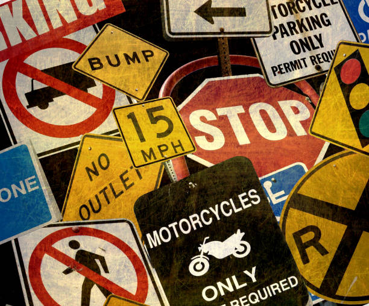
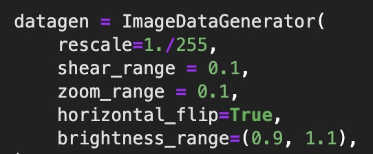
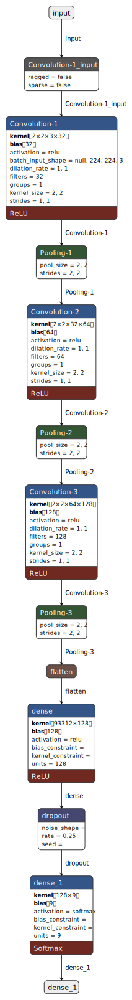
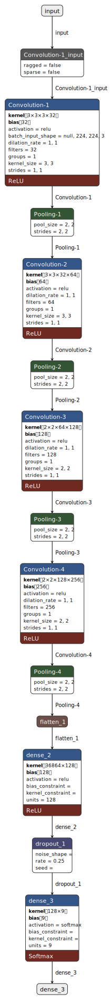
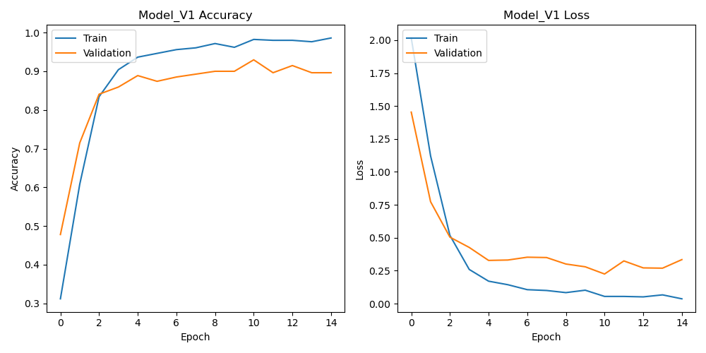
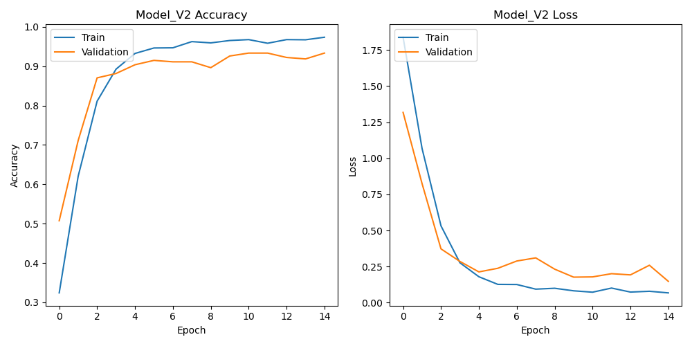
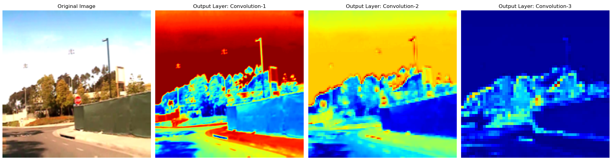
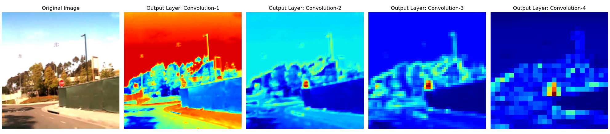

# **The Road Ahead:**
## Creating a CNN for Traffic Sign Detection and Classification

# **Introduction**
Tesla's automated driving cars have revolutionized the way we perceive traffic sign detection. It's a marvel that evokes the fascination I have with machine learning and its real world applications. Traffic sign detection is an integral part of autonomous driving technology that ensures safety and regulation compliance. My curiosity led me to explore how a CNN could be implemented to detect and interpret traffic signs, using cutting-edge technologies such as TensorFlow and Keras. I also made use of other essential libraries like Pandas, NumPy, Matplotlib and SciKit-Learn, creating a comprehensive toolkit for traffic sign detection. The journey led me to develop three Jupyter notebooks, each serving a unique purpose: Exploratory Data Analysis (EDA), Modeling, and Grad-CAM Visualization. The future of driving is here, and it's governed by the silent commands of traffic signs, interpreted by the brilliant minds of machines.

# **Finding Data and EDA**
Like all projects, the first step was to find data. Originally, I planned on using the full LISA (Laboratory for Intelligent and Safe Automobiles) traffic sign dataset containing 6,610 images and 47 classes. Unfortunately, the original source to this data from UC San Diego is no longer available. Luckily, on Kaggle I found a version of the dataset called Tiny LISA which contains 900 images and 9 classes. It also contained an annotations CSV where each annotation is a row containing the name of the file with enumeration and the traffic sign class label to which the file belongs. The images were 704 x 480 pixels in RGB format. 

The preparation of the dataset began with reading annotations, where image and class information were extracted from a CSV file, followed by image augmentation using techniques like rescaling and zooming to enrich the training set. The images were then loaded and resized to a standard size. Label transformation was done to one-hot encode the class labels for multi-class classification, allowing the system to recognize different traffic signs. Finally, all the augmented images and labels were converted to numpy arrays, making them ready for input into the deep learning model. 

Using the generator, I acquired a total of 2700 images distributed across the same 9 classes. These were divided into three different sets: a training set consisting of 2160 images, a validation set with 270 images, and a hold-out set, also comprising 270 images.

# **Modeling**
Utilizing Keras's sequential model, I constructed the CNN and explored different architectural designs. After a meticulous process of fine-tuning various hyperparameters, it became evident that the ReLU activation function was optimal for this specific challenge. Adjustments were made to the number of epochs and batch size, though these modifications yielded minimal impact on the overall performance. In my examination of the two cold start models, I noted that the epochs tended to plateau quite early, a phenomenon addressed by implementing early stopping. Conversely, the transfer learning model employing VGG19 consistently reached the maximum number of epochs. Due to the VGG19 model's considerable slowness and computational expense with similar results, I ultimately chose to abandon that approach.

<table align="center" width="100%">
  <tr>
    <th align="center">Model Version 1</th>
    <th align="center">Model Version 2</th>
  </tr>
  <tr>
    <td align="center" valign="top">
      
    </td>
    <td align="center" valign="top">
      
    </td>
  </tr>
</table>

## Model 1 Results

| Epoch | Train Loss | Train Accuracy | Validation Loss | Validation Accuracy |
|-------|------------|----------------|-----------------|---------------------|
| 1     | 2.0165     | 0.3116         | 1.4536          | 0.4778              |
| 2     | 1.1211     | 0.6079         | 0.7736          | 0.7148              |
| 3     | 0.5179     | 0.8343         | 0.5046          | 0.8407              |
| 4     | 0.2595     | 0.9042         | 0.4266          | 0.8593              |
| 5     | 0.1705     | 0.9366         | 0.3281          | 0.8889              |
| 6     | 0.1436     | 0.9463         | 0.3311          | 0.8741              |
| 7     | 0.1061     | 0.9560         | 0.3524          | 0.8852              |
| 8     | 0.0998     | 0.9606         | 0.3499          | 0.8926              |
| 9     | 0.0836     | 0.9718         | 0.3008          | 0.9000              |
| 10    | 0.1020     | 0.9620         | 0.2797          | 0.9000              |

## Model 2 Results

| Epoch | Train Loss | Train Accuracy | Validation Loss | Validation Accuracy |
|-------|------------|----------------|-----------------|---------------------|
| 1     | 1.8388     | 0.3241         | 1.3178          | 0.5074              |
| 2     | 1.0684     | 0.6204         | 0.8251          | 0.7111              |
| 3     | 0.5319     | 0.8111         | 0.3724          | 0.8704              |
| 4     | 0.2761     | 0.8926         | 0.2854          | 0.8815              |
| 5     | 0.1794     | 0.9324         | 0.2129          | 0.9037              |
| 6     | 0.1265     | 0.9463         | 0.2380          | 0.9148              |
| 7     | 0.1256     | 0.9468         | 0.2884          | 0.9111              |
| 8     | 0.0934     | 0.9625         | 0.3101          | 0.9111              |
| 9     | 0.0995     | 0.9593         | 0.2319          | 0.8963              |
| 10    | 0.0819     | 0.9653         | 0.1766          | 0.9259              |

The second model performed slightly better than the first and I decided to move forward with it. On the hold out set it was 92.96 percent accurate with a loss of 0.2318 which is similar to the best validation accuracy and loss. As you can see with both models, after epoch 5 it begins experiencing diminishing returns and completely flattens off as it moves towards the end.

## Vizualtization

I created a function designed to illustrate the activations within specific layers. Accepting an input image, the model, and a list of layers to visualize, it generates a series of images displaying how the input is transformed across those layers. The visualizations provide insights into how different layers respond to the input, assisting in understanding the model's behavior.

It is evident that the second model exhibits a superior ability to focus on the stop sign, demonstrating a refined detection mechanism. In contrast, the first model exhibits a less precise localization of the stop sign.